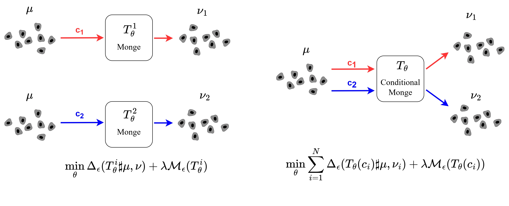

# Conditional Monge Gap

[](https://github.com/AI4SCR/conditional-monge/actions/workflows/ci.yml)
[](https://opensource.org/licenses/MIT)



An extension of the [Monge Gap](https://proceedings.mlr.press/v202/uscidda23a.html), an approach to estimate transport maps conditionally on arbitrary context vectors. It is based on a two-step training procedure combining an encoder-decoder architecture with an OT estimator. The model is applied to [4i](https://pubmed.ncbi.nlm.nih.gov/30072512/) and [scRNA-seq](https://www.ncbi.nlm.nih.gov/pmc/articles/PMC7289078/) datasets.

## Installation from PyPI

You can install this package as follows
```sh
pip install cmonge
```

## Development setup & installation
The package environment is managed by [poetry](https://python-poetry.org/docs/managing-environments/). 
The code was tested in Python 3.10.
```sh
pip install poetry
git clone git@github.com:AI4SCR/conditional-monge.git
cd cmonge
poetry install -v
```

If the installation was successful you can run the tests using pytest
```sh
poetry shell # activate env
pytest
```

## Data

The preprocessed version of the Sciplex3 and 4i datasets can be downloaded [here](https://www.research-collection.ethz.ch/handle/20.500.11850/609681).


## Example usage

You can find example config in `configs/conditional-monge-sciplex.yml`.
To train an autoencoder model:
```py
from cmonge.datasets.conditional_loader import ConditionalDataModule
from cmonge.trainers.ae_trainer import AETrainerModule
from cmonge.utils import load_config


config_path = Path("configs/conditional-monge-sciplex.yml")
config = load_config(config_path)
config.data.ae = True

datamodule = ConditionalDataModule(config.data, config.condition)
ae_trainer = AETrainerModule(config.ae)

ae_trainer.train(datamodule)
ae_trainer.evaluate(datamodule)
```

To train a conditional monge model:

```py
from cmonge.datasets.conditional_loader import ConditionalDataModule
from cmonge.trainers.conditional_monge_trainer import ConditionalMongeTrainer
from cmonge.utils import load_config

config_path = Path("configs/conditional-monge-sciplex.yml")
logger_path = Path("logs")
config = load_config(config_path)

datamodule = ConditionalDataModule(config.data, config.condition)
trainer = ConditionalMongeTrainer(jobid=1, logger_path=logger_path, config=config.model, datamodule=datamodule)

trainer.train(datamodule)
trainer.evaluate(datamodule)
```

## Older checkpoints loading
If you want to load model weights of older checkpoints (cmonge-{moa, rdkit}-ood or cmonge-{moa, rdkit}-homogeneous), make sure you are on the tag `cmonge_checkpoint_loading`.

```sh
git checkout cmonge_checkpoint_loading
```

## Citation
If you use the package, please cite:
```bib
@article{driessen2025towards,
  title={Towards generalizable single-cell perturbation modeling via the Conditional Monge Gap},
  author={Driessen, Alice and Harsanyi, Benedek and Rapsomaniki, Marianna and Born, Jannis},
  journal={arXiv preprint arXiv:2504.08328},
  note={Preliminary version at ICLR 2024 Workshop on Machine Learning for Genomics Explorations}
  year={2025}
}
```
